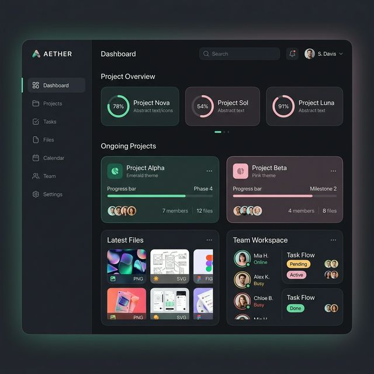

# Grayola Premium - Plataforma de Gestión de Diseño as a Service (DaaS)



[](https://appfullstack.netlify.app)

Esta es una aplicación fullstack empresarial de alto rendimiento diseñada para la gestión ágil de proyectos de diseño. Optimiza la colaboración entre directores creativos, diseñadores y clientes finales mediante un flujo de trabajo centralizado y una interfaz premium.

🔗 **[Acceder a la Plataforma en Producción (Netlify)](https://appfullstack.netlify.app)**

---

## 🚀 Tecnologías Destacadas


---

## 📋 Tabla de Contenidos
- [🎯 Propuesta de Valor](#-propuesta-de-valor)
- [🔄 Flujo Completo del Proyecto](#-flujo-completo-del-proyecto)
- [🧱 Arquitectura y Estructura](#-arquitectura-y-estructura)
- [🛡️ Roles y Permisos (Seguridad RLS)](#-roles-y-permisos-seguridad-rls)
- [🎨 Experiencia de Usuario (UI/UX)](#-experiencia-de-usuario-uiux)
- [🚀 Instalación](#-instalación)
- [🔐 Credenciales Demo](#-credenciales-demo)

---

## 🎯 Propuesta de Valor

Grayola democratiza el acceso a servicios de diseño de alta calidad mediante un modelo de suscripción eficiente. A diferencia de agencias tradicionales, Grayola ofrece:
- **Colaboración Centralizada**: Todo el flujo de trabajo (brief, diseño, revisión) ocurre en un solo lugar.
- **Roles Definidos**: Permisos granulados para asegurar que cada parte vea solo lo que necesita.
- **Gestión Documental**: Repositorio seguro para assets de diseño vinculados a proyectos específicos.

---

## 🔄 Flujo Completo del Proyecto

La plataforma gestiona el ciclo de vida completo de una solicitud creativa:

1.  **Creación del Pedido (Briefing)**: El **Cliente** o el **Project Manager** crea un nuevo proyecto completando un formulario detallado con objetivos, requisitos y adjuntando archivos iniciales.
2.  **Asignación Estratégica**: El **Project Manager** revisa la solicitud y asigna el proyecto al **Diseñador** más apto dentro del equipo.
3.  **Desarrollo Creativo**: El **Diseñador** recibe una notificación en tiempo real, accede al proyecto y comienza a trabajar en las piezas solicitadas.
4.  **Entrega y Revisión**: El diseñador sube las propuestas al módulo de documentos del proyecto. El cliente es notificado para revisar.
5.  **Iteración / Aprobación**: El cliente puede solicitar ajustes o aprobar la entrega final. Todo el historial de cambios queda registrado para futura referencia.

---

## 🛡️ Roles y Permisos (Seguridad RLS)

El sistema utiliza **Row Level Security (RLS)** de PostgreSQL para garantizar que la privacidad de los datos sea absoluta.

| Rol | Icono | Alcance de Permisos | Visibilidad |
|:--- |:---:|:--- |:---|
| **Project Manager** | 🛡️ | Control total del ecosistema Grayola. | Puede ver/editar/borrar todos los proyectos y usuarios. |
| **Diseñador** | 🎨 | Ejecución técnica y carga de archivos. | Solo ve proyectos asignados a su perfil. |
| **Cliente** | 🏢 | Creación de solicitudes y revisión. | Solo ve los proyectos que él mismo ha creado. |

---

## 🛠️ Herramientas de Desarrollo

- **Radix UI & Shadcn/UI**: Componentes de interfaz accesibles y altamente personalizables.
- **Lucide React**: Set de iconos consistentes para una navegación intuitiva.
- **Next Themes**: Gestión impecable de Dark Mode y Light Mode.
- **Date-fns**: Localización y formateo de fechas en español.
- **UUID**: Identificadores únicos universales para transacciones seguras.
- **Sonner**: Notificaciones tipo toast modernas y no intrusivas.

---

## ✨ Experiencia de Usuario (UI/UX)

La plataforma cuenta con una interfaz **Premium SaaS** diseñada para la claridad visual:
- **Dashboard Dinámico**: Estadísticas en tiempo real basadas en el rol del usuario conectado.
- **Vistas Duales**: Visualización en formato de **Tarjetas (Gallery)** o **Lista**, adaptándose a la preferencia del usuario.
- **Notificaciones Push-like**: Sistema integrado que alerta sobre nuevos proyectos o cambios de estado instantáneamente.
- **Diseño Adaptativo**: Optimizado para una experiencia fluida en smartphones, tablets y monitores ultrawide.

---

## 🚀 Instalación y Configuración

### 1. Clonado e Instalación
```bash
git clone https://github.com/ValeriaAlarcon119/App-con-Next.js-y-Supabase.git
cd aplicacion-fullstack
npm install
```

### 2. Variables de Entorno
Crea un archivo `.env.local`:
```env
NEXT_PUBLIC_SUPABASE_URL=tu_url_de_supabase
NEXT_PUBLIC_SUPABASE_ANON_KEY=tu_anon_key
NEXT_PUBLIC_SITE_URL=http://localhost:3000
```

### 3. Lanzamiento
```bash
npm run dev
```

---

## 🔐 Credenciales de Acceso (Demo)

| Perfil | Email | Contraseña |
|:--- |:---|:---|
| **Project Manager** | `marian45@gmail.com` | `password123` |
| **Diseñador** | `designer3@grayola.com` | `password123` |
| **Cliente Externo** | `prueba1@gmail.com` | `password123` |

---

## 📁 Estructura del Proyecto

```
src/
├── app/               # App Router: Rutas, Layouts y Server Components
│   ├── (auth)/        # Autenticación y acceso
│   └── (dashboard)/   # Módulos de Proyectos, Documentos y Billing
├── components/        # Componentes UI reutilizables (Shadcn + Custom)
├── hooks/             # Lógica reactiva (Autenticación, validación)
├── lib/               # Clientes de servicios externos (Supabase)
└── types/             # Definiciones de TypeScript para el modelo de datos
```

---

## 📧 Contacto

**Valeria Alarcón**  
*Front-end & Product Developer*  
📩 [valeriaalarocn119@gmail.com](mailto:valeriaalarocn119@gmail.com)  
🌎 [LinkedIn Profile](https://www.linkedin.com/in/valeria-alarcon-andrade-45663a233/)
